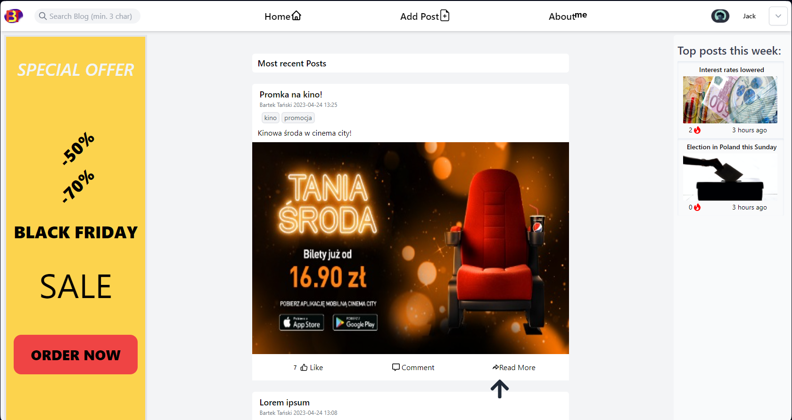
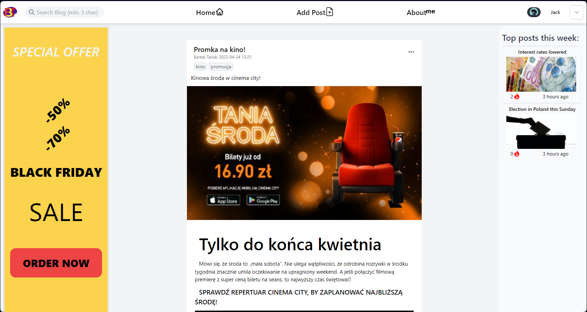
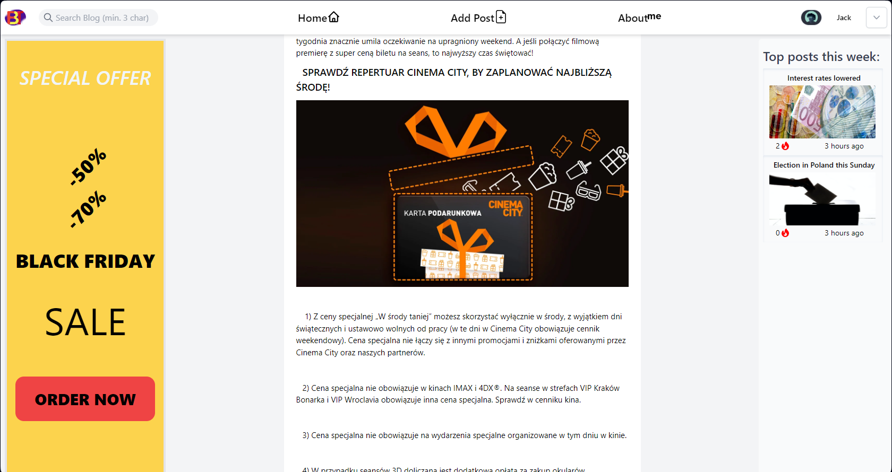
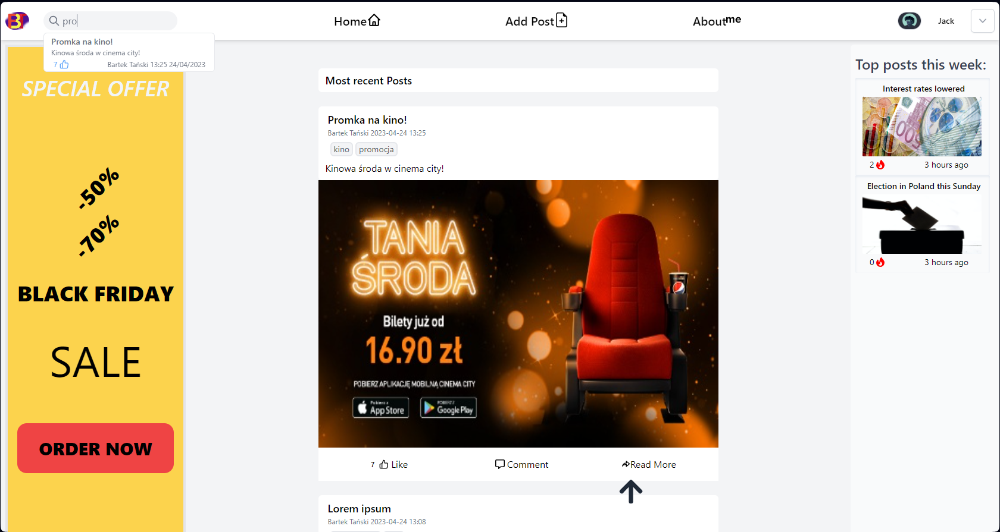
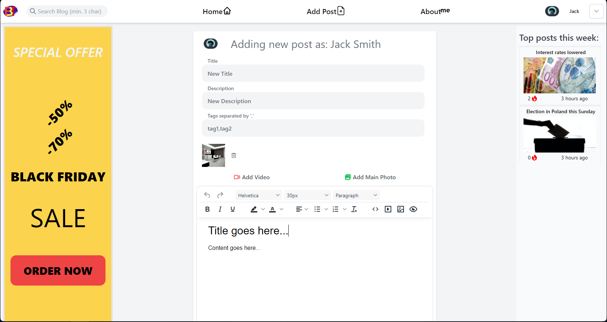
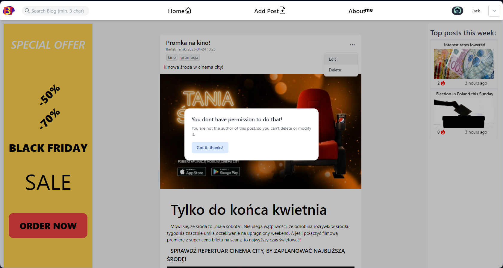
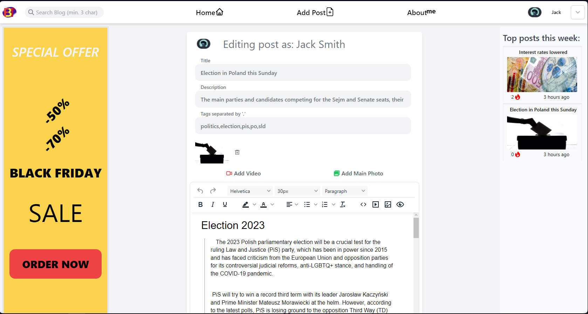
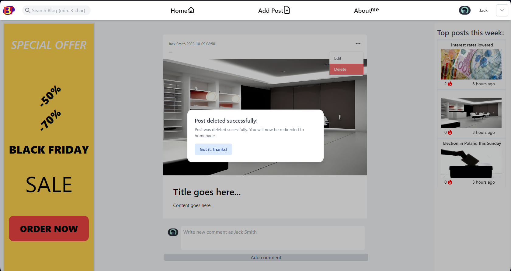
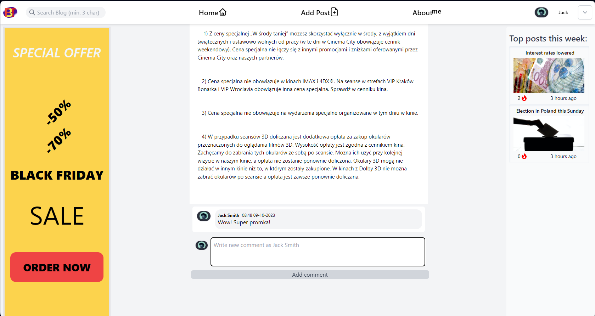

## Multi module spring boot project 
### consistring of:
- mail service - sending emails and email templates, used for email verification and password change
- user service - user authentication
- posts service - all operations connected to posts 
### App utilizes JWT and Spring Security to secure and provide user authentication
### Its connected to 2 databases:
- PostgreSQL - user service
- MongoDB - posts service
Communicating with AWS RDS PostgreSQL db. Utilizing Java mail API  
## Deployed to AWS EC2 virtual machine
### frontend: [Demo]([https://bartosztanski.azurewebsites.net](https://bartosztanski.azurewebsites.net)
## Home 
[ Link](https://bartosztanski.azurewebsites.net)

### Post
[ Link](https://bartosztanski.azurewebsites.net/posts/6523bc7072bf6b63d22092e8?postIndex=0)

### Search
[ Link](https://bartosztanski.azurewebsites.net)

### Adding post
[ Link](https://bartosztanski.azurewebsites.net/posts/createPost)

### Editing/deleting post
[_Link - authorization needed](https://bartosztanski.azurewebsites.net/posts/6501fadf13f41a7dc052d57a)

### Editing
[_Link - authorization needed](https://bartosztanski.azurewebsites.net/posts/edit/6501fadf13f41a7dc052d57a)

### Deleting
[_Link - authorization needed](https://bartosztanski.azurewebsites.net/posts/6501fadf13f41a7dc052d57a)

### Adding Comments
[ Link](https://bartosztanski.azurewebsites.net/posts/6523bc7072bf6b63d22092e8?postIndex=0)

